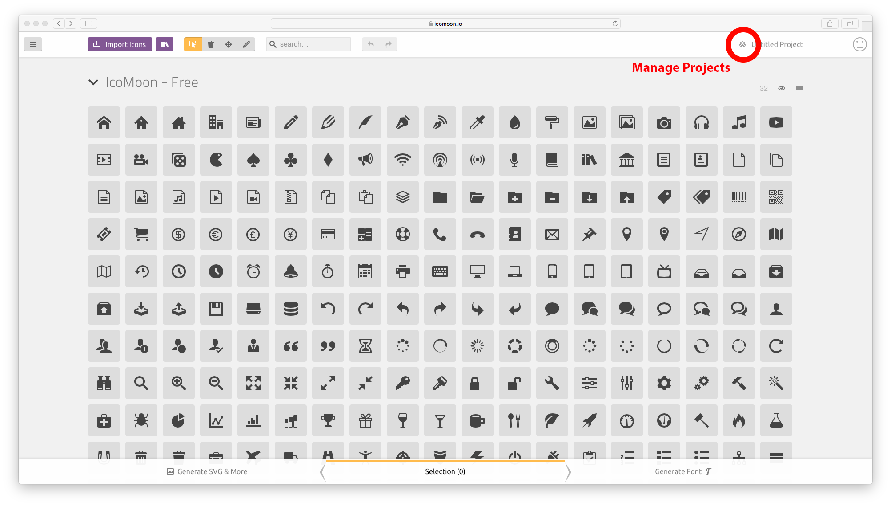
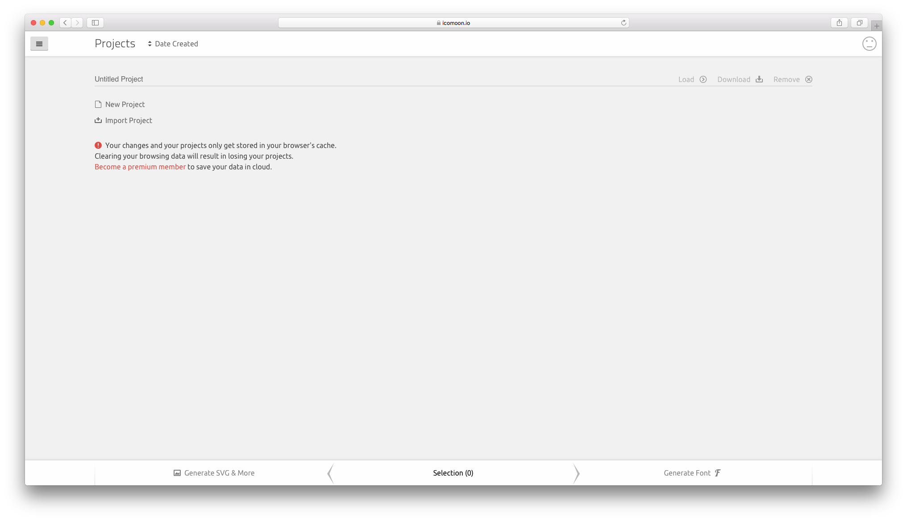
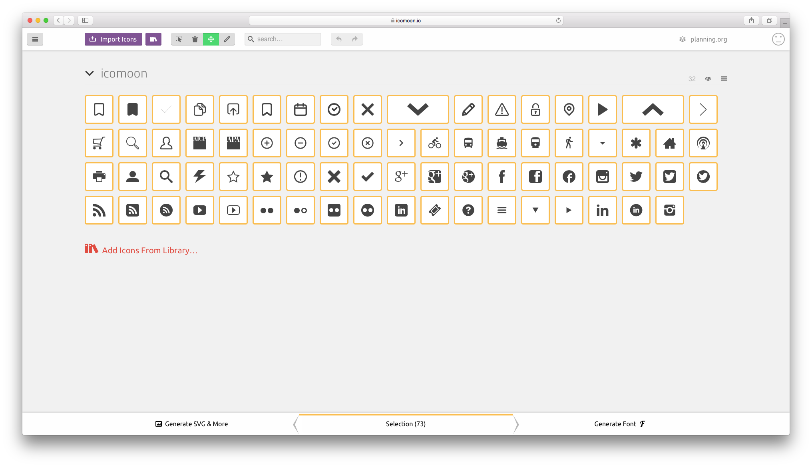
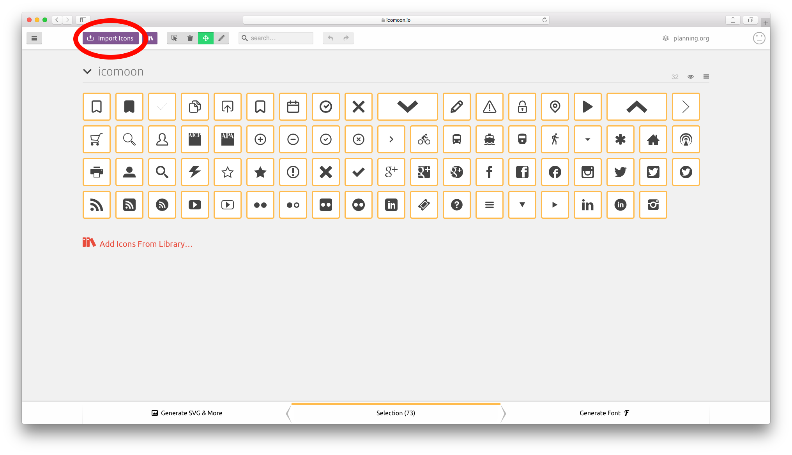
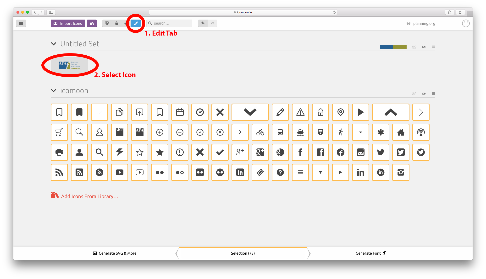
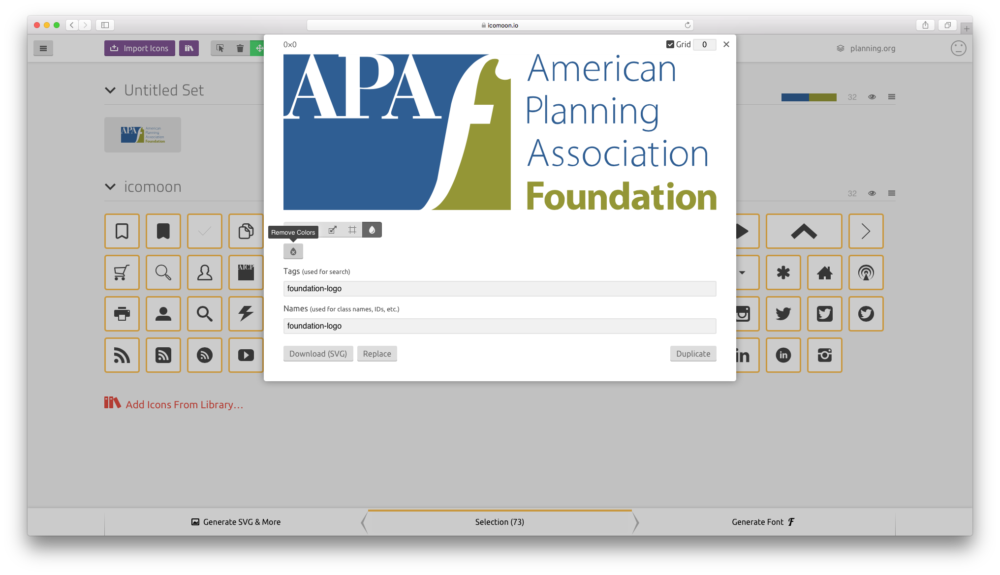
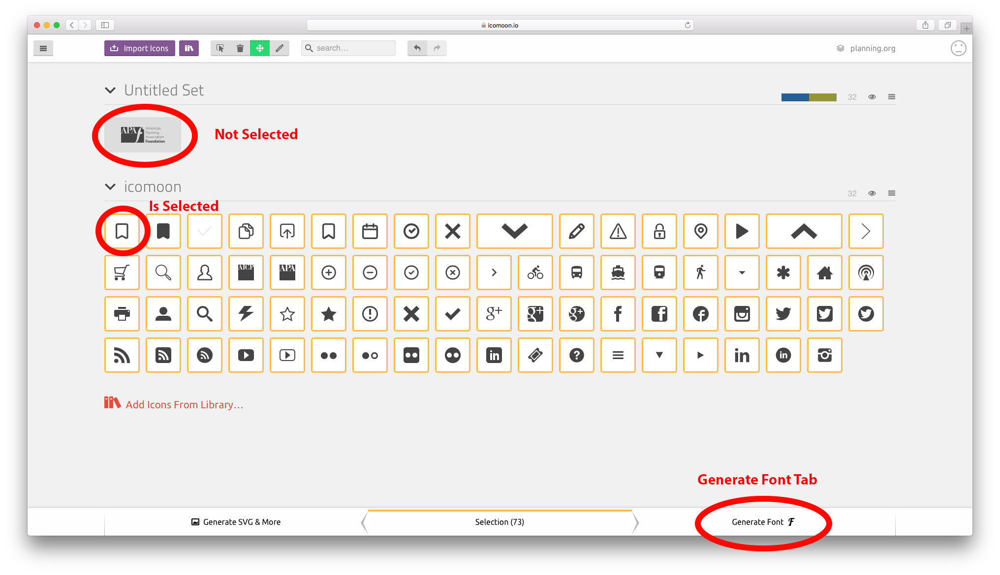
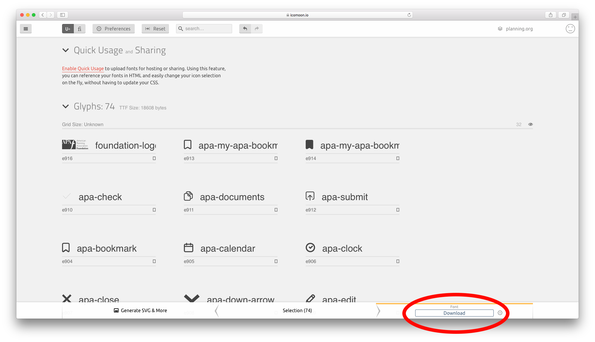

Icomoon Icons
=============

We use Icomoon to create icon fonts and images used on site.
https://icomoon.io/

Importing APA’s Icomoon project
-------------------------------

1. Go to icomoon’s online application. https://icomoon.io/app/ and click
   the “Manage Projects” button in the upper right corner. There is no
   need to create an account unless you plan on maintaining more than 4
   projects. |Icomoon app screen shot|

2. Choose to “Import Project” and select the json file for the project
   tha you wanty to import. Within our planning.org repository, this
   lives at content/static/content/css/icomoon/selection.json (this json
   file is created when exporting an icomoon project to a font or svgs)
   |import project|

3. Rename and choose to load the newly imported project. |project screenshot|

Adding an Icon
--------------

Internal
~~~~~~~~

Icomoon has several libraries of icons to choose from. Some require
purchase and others are free. The process for adding an icon from one of
these libraries is pretty straightforward. Click “Add Icons From
Library”, browse the available libraries, select the icons you want.

External
~~~~~~~~

Icomoon also lets you upload your own custom icons. In the past
Sandstorm Design has sent us any icons that they want to be available in
our icon font online and we have imported them into our project. Each
icon you upload should be a SVG file. Before uploading each icon make
any necessary edits in Adobe Illustrator. For example, you may need to
convery strokes to fills (https://icomoon.io/#docs/stroke-to-fill).

Then follow these to import icons…

1. Click the “Import Icon” button in the upper left part of the header
   and select the svg image you want to import. You can also drag and
   drop svg images in the project. |import screenshot|

2. You might need to edit the icon you just imported. For example, you
   should remove color from uploaded icons. Click the pencil (edit) tab
   in the header and select the icon you wish to edit. |edit screenshot|

3. Remove color from the icon, or make any other edits |edit panel screenshot|

Downloading Font Set
--------------------

1. Make sure all the icons you want to include in your icon set are
   selected (highlighted). And click the “Generate Font” tab in the
   bottom right. |font screenshot|

2. Make any edits and customize the character codes for each icon if
   necessary (in most cases, leave as is) and click download. |download screenshot|

3. The downloaded zip file should include a folder with several font
   files (eot, svg, ttf, woff), a css file, and a selection.json file.
   Move the entire contents of this folder to our planning.org project
   (content/static/content/css/icomoon/).

