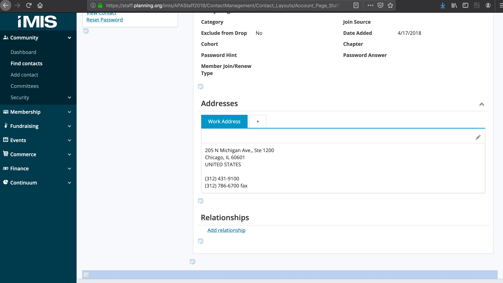
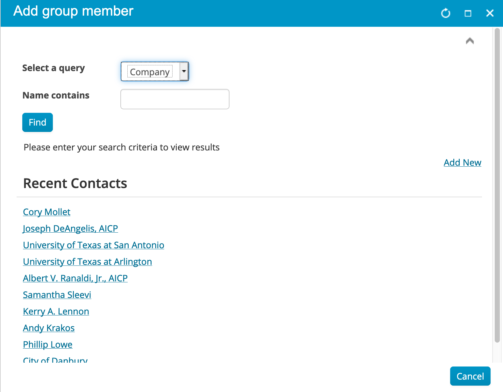
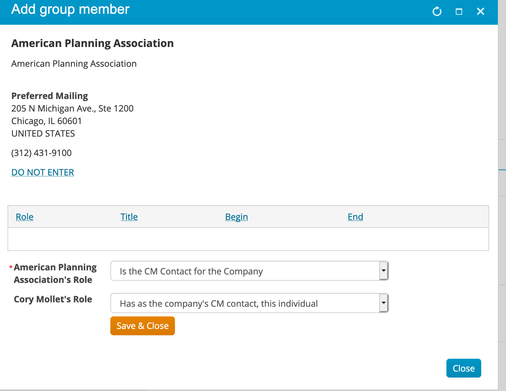

#####
MyOrg
#####

*******************
Admin Relationships
*******************

Administrators must have an entry in the iMIS Relationships table. The user's ID must be the value for the ``ID`` field and the organization's ID must be the value for the ``TARGET_ID`` field.

The ``RELATION_TYPE`` field bust be either ``ADMIN_I`` or ``CM_I`` in order to be considered a MyOrg administrator. An administrator can only be an admin of one organization at a time. If they have other ``ADMIN_I`` or ``CM_I`` entries in there with a ``TARGET_ID`` to a different organization that the one they are supposed to be an administrator of, those entries will have to be deleted. So far, this has been a common source of support requests - either administrators don't have access or their admin relationship is to the wrong organization.

*************************
iMIS Staff Site Confusion
*************************

Relationship entries can be added/changed/deleted in the iMIS Staff Site, at the bottom of an individual contact page in the "Relationships" section.

|relationships|

However the terminology is incredibly confusing. When adding a relationship, choose "Company" for ``Select a query`` and then search for the company name.

|find company|

After selecting the company, the company's role should be "Is the CM Contact for the Company." ("Is the Administrative Contact for the Company" will also grant access, those are the ``CM_I``/``ADMIN_I`` relation types, respectively). The user's role should automatically change, no selection necessary.

|relation_type|

